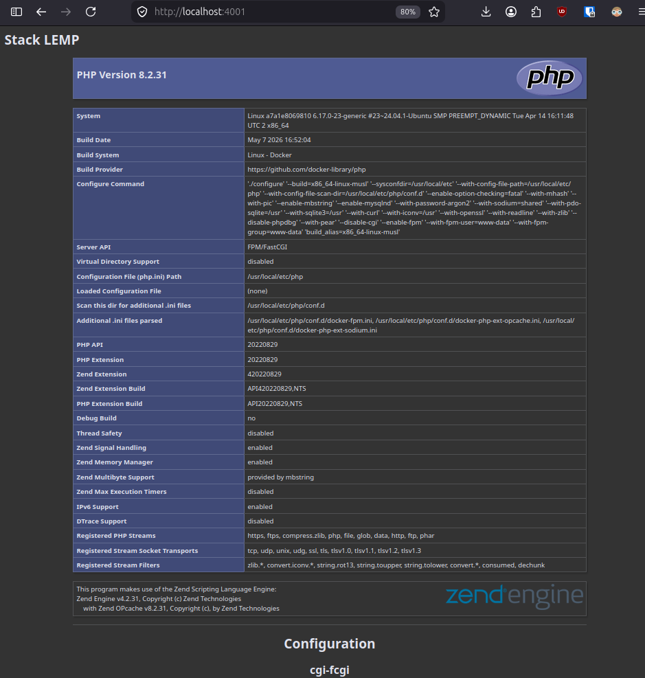
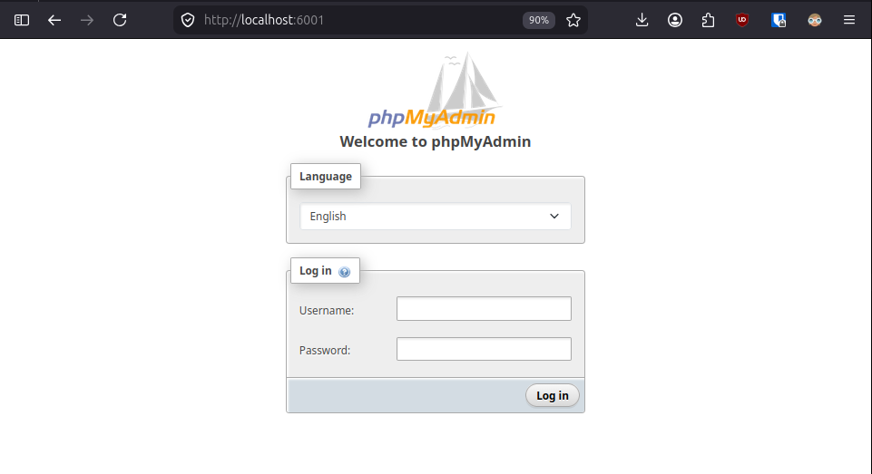
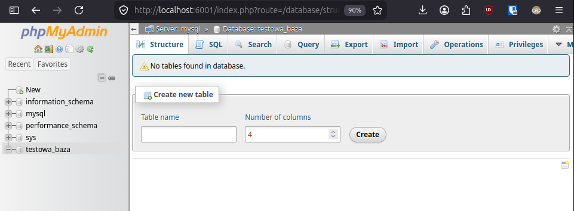
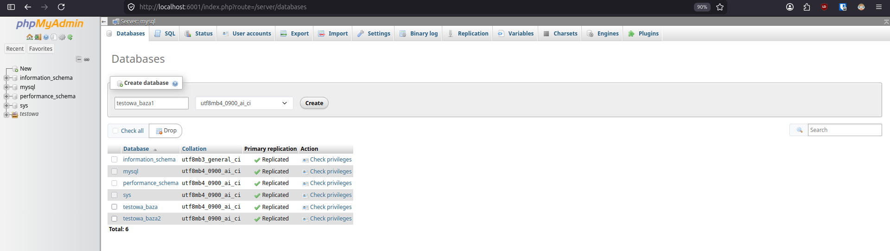
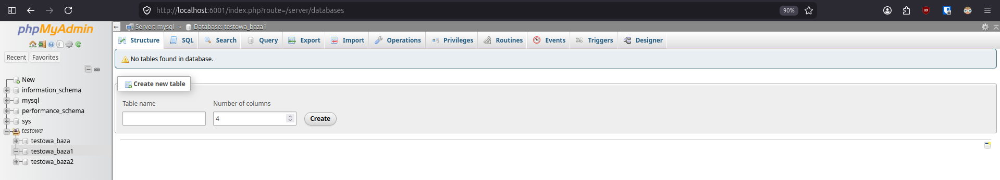
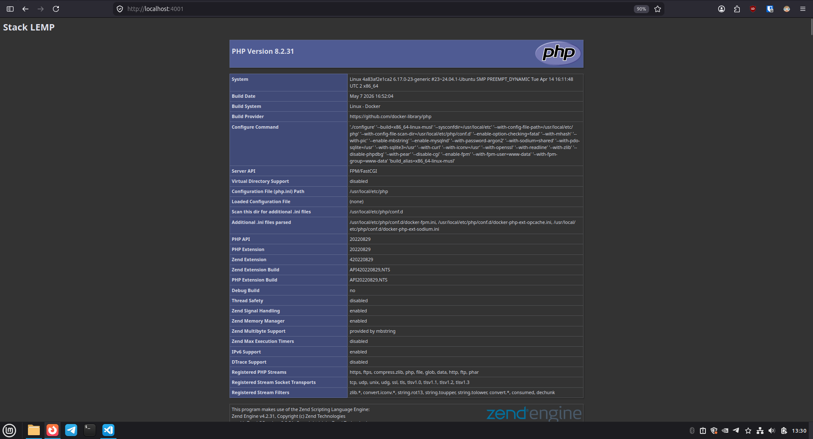
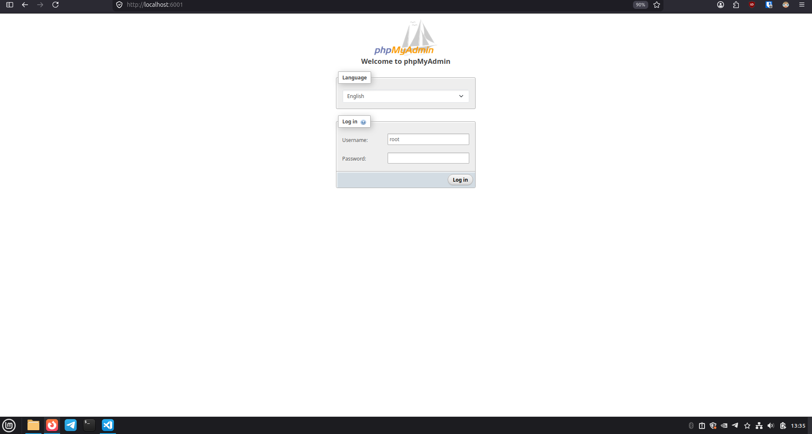
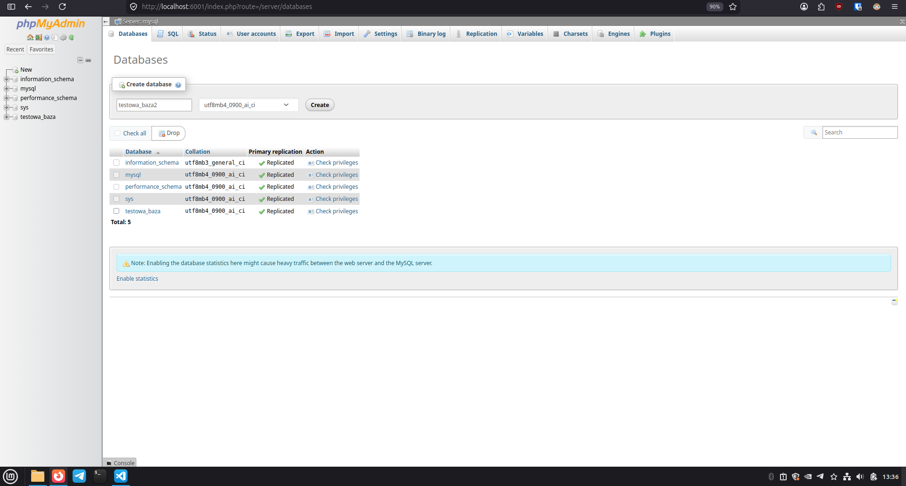
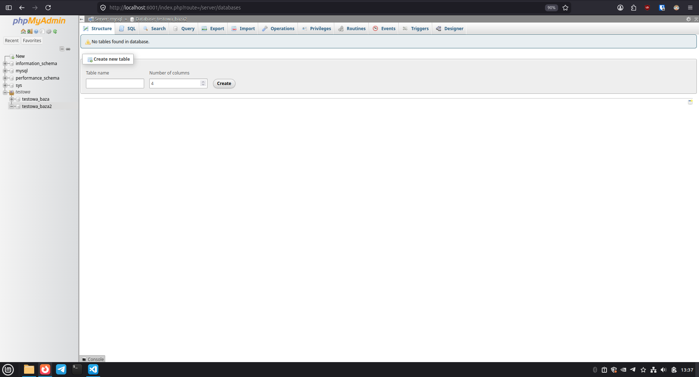

# Lab13 - część obowiązkowa i dodatkowa
Zbudowanie prostego pliku docker-compose.yml, który pozwoli na uruchomienie stack-a LEMP wraz z phpMyAdmin.
## Część obowiązkowa

Początkowo (w części obowiązkowej zadania) dane wrażliwe zostały dodane do pliku .env.
Odczyt z pliku .env w docker-compose.yml:
```
MYSQL_ROOT_PASSWORD: ${MYSQL_ROOT_PASSWORD}
MYSQL_DATABASE: ${MYSQL_DATABASE}
```

**Komenda uruchamiająca kontenery:** `docker compose up -d`

<details>
<summary>Wynik komendy:</summary>

```
[+] up 6/6
 ✔ Network lab13_backend        Created 0.0s
 ✔ Network lab13_frontend       Created 0.0s
 ✔ Container lab13-php-1        Created 0.0s
 ✔ Container lab13-mysql-1      Created 0.0s
 ✔ Container lab13-phpmyadmin-1 Created 0.0s
 ✔ Container lab13-nginx-1      Created 0.0s
```

</details>
<br>

**Komenda wyłączająca kontenery:** `docker compose down`

<details>
<summary>Wynik komendy:</summary>

```
[+] down 6/6
 ✔ Container lab13-phpmyadmin-1 Removed 1.1s
 ✔ Container lab13-nginx-1      Removed 0.2s
 ✔ Container lab13-php-1        Removed 0.1s
 ✔ Container lab13-mysql-1      Removed 0.6s
 ✔ Network lab13_backend        Removed 0.1s
 ✔ Network lab13_frontend       Removed 0.2s
```

</details>
<br>

**Strona:** http://localhost:4001/

**Phpmyadmin:** http://localhost:6001/

### Potwierdzenie działania kontenerów

`docker ps`
```
CONTAINER ID   IMAGE                           COMMAND                  CREATED          STATUS          PORTS                                     NAMES
3d39f67715ec   nginx:1.31-alpine               "/docker-entrypoint.…"   11 minutes ago   Up 10 minutes   0.0.0.0:4001->80/tcp, [::]:4001->80/tcp   lab13-nginx-1
34051fff1d93   phpmyadmin/phpmyadmin:5.2       "/docker-entrypoint.…"   11 minutes ago   Up 10 minutes   0.0.0.0:6001->80/tcp, [::]:6001->80/tcp   lab13-phpmyadmin-1
37ae4dfead90   php:8.2-fpm-alpine              "docker-php-entrypoi…"   11 minutes ago   Up 10 minutes   9000/tcp                                  lab13-php-1
e360095edbff   mysql:9.7.0                     "docker-entrypoint.s…"   11 minutes ago   Up 10 minutes   3306/tcp, 33060/tcp                       lab13-mysql-1
```
### Potwierdzenie działania sieci


#### Wyjaśnienie sposobu przyłączenia phpMyAdmin do sieci

Mikrousługa `phpMyAdmin` została podłączona wyłącznie do sieci `backend`. Wynika to z faktu, że jej jedynym zadaniem jest bezpośrednia komunikacja z serwerem bazy danych MySQL, który znajduje się tylko w sieci `backend` w celu izolacji od ruchu z zewnątrz. Wystawienie portu `6001:80` w pliku `docker-compose.yml` realizuje mapowanie portów z hosta na kontener i umożliwia dostęp do interfejsu z poziomu przeglądarki użytkownika. Przyłączenie phpMyAdmin do sieci `frontend` łamałoby zasady separacji warstw.

**Sprawdzenie poprawności konfiguracji sieci:**

`docker network inspect lab13_backend`
<details>
<summary>Wynik komendy:</summary>

```
[
    {
        "Name": "lab13_backend",
        "Id": "8867fa1e81252febfdea92f6252e667538e30835f8e90a740352b527e5e8ea68",
        "Created": "2026-06-05T11:11:24.195651186+02:00",
        "Scope": "local",
        "Driver": "bridge",
        "EnableIPv4": true,
        "EnableIPv6": false,
        "IPAM": {
            "Driver": "default",
            "Options": null,
            "Config": [
                {
                    "Subnet": "172.28.0.0/16",
                    "Gateway": "172.28.0.1"
                }
            ]
        },
        "Internal": false,
        "Attachable": false,
        "Ingress": false,
        "ConfigFrom": {
            "Network": ""
        },
        "ConfigOnly": false,
        "Options": {},
        "Labels": {
            "com.docker.compose.config-hash": "303a5c6a665d112f4cfee901befcc7bb1f43b97b72bbbccd3bbe862f5d0e35b7",
            "com.docker.compose.network": "backend",
            "com.docker.compose.project": "lab13",
            "com.docker.compose.version": "5.0.2"
        },
        "Containers": {
            "34051fff1d9309ca5c4593742a4ae816508812f19d8b53c648c3082b661e9a5f": {
                "Name": "lab13-phpmyadmin-1",
                "EndpointID": "3478b471b459c0352fb335cea419cd516fee7ebf807be09ed05c249b676db4b0",
                "MacAddress": "9e:53:72:4c:50:29",
                "IPv4Address": "172.28.0.4/16",
                "IPv6Address": ""
            },
            "37ae4dfead9076cf21609feadac04f81362710e0f374692b5a5d4c4d44d8210d": {
                "Name": "lab13-php-1",
                "EndpointID": "f3306828fd17a1bbc3d3892568e6432046838ae794106e54daf49fafa95084c5",
                "MacAddress": "ea:a9:5c:40:de:55",
                "IPv4Address": "172.28.0.3/16",
                "IPv6Address": ""
            },
            "3d39f67715ec181c28bf838b38a4098e9a83cb3a076cc813250656b86398d2f3": {
                "Name": "lab13-nginx-1",
                "EndpointID": "42497d2d7c63fb003bbec56f9cf5dfd4f7dc4a632d39f3f1d06e7fc3b2a21b5f",
                "MacAddress": "72:14:0b:56:23:68",
                "IPv4Address": "172.28.0.5/16",
                "IPv6Address": ""
            },
            "e360095edbffbc6f02a30e4a320fa1f7ce8ec529ada02cabe22efd3793d097f1": {
                "Name": "lab13-mysql-1",
                "EndpointID": "05976619ec7e0cdc0c5b45ac35254b61775180b492e14eb2b0246b093dbe7836",
                "MacAddress": "6e:cd:04:fd:ad:27",
                "IPv4Address": "172.28.0.2/16",
                "IPv6Address": ""
            }
        },
        "Status": {
            "IPAM": {
                "Subnets": {
                    "172.28.0.0/16": {
                        "IPsInUse": 7,
                        "DynamicIPsAvailable": 65529
                    }
                }
            }
        }
    }
]
```


</details>
<br>

`docker network inspect lab13_frontend`

<details>
<summary>Wynik komendy:</summary>

```
[
    {
        "Name": "lab13_frontend",
        "Id": "2f63a0ad27c2490764fe340251a51670fff368757e5f042351acd2062b9c514f",
        "Created": "2026-06-05T11:11:24.217578438+02:00",
        "Scope": "local",
        "Driver": "bridge",
        "EnableIPv4": true,
        "EnableIPv6": false,
        "IPAM": {
            "Driver": "default",
            "Options": null,
            "Config": [
                {
                    "Subnet": "172.29.0.0/16",
                    "Gateway": "172.29.0.1"
                }
            ]
        },
        "Internal": false,
        "Attachable": false,
        "Ingress": false,
        "ConfigFrom": {
            "Network": ""
        },
        "ConfigOnly": false,
        "Options": {},
        "Labels": {
            "com.docker.compose.config-hash": "c99dfed360a6944db43f183a5bd3f4016b0c10584adeeaa2e535a0bc34386287",
            "com.docker.compose.network": "frontend",
            "com.docker.compose.project": "lab13",
            "com.docker.compose.version": "5.0.2"
        },
        "Containers": {
            "3d39f67715ec181c28bf838b38a4098e9a83cb3a076cc813250656b86398d2f3": {
                "Name": "lab13-nginx-1",
                "EndpointID": "797d5158b55b56dd095622de9dde7baddf7a014bfba4251a7778839cfcc13324",
                "MacAddress": "c6:63:de:49:a9:ba",
                "IPv4Address": "172.29.0.2/16",
                "IPv6Address": ""
            }
        },
        "Status": {
            "IPAM": {
                "Subnets": {
                    "172.29.0.0/16": {
                        "IPsInUse": 4,
                        "DynamicIPsAvailable": 65532
                    }
                }
            }
        }
    }
]
```

</details>

Jak widać powyżej, do sieci backend zostały przyłączone: mysql, nginx, php, phpmyadmin. Natomiast do sieci frontend został przyłączony jednynie nginx.

### Potwierdzenie działania strony


Strona index.php

### Potwierdzenie działania phpmyadmin


Logowanie do phpmyadmin


Phpmyadmin - użytkownik zalogowany.


Phpmyadmin - tworzenie bazy.


Phpmyadmin - nowa baza.

## Część dodatkowa

Dodanie folderu `secrets/` i dodanie go do `.gitignore`.
W secrets zostały umieszczone dane wrażliwe.

W `docker-compose.yml` zostały użyte secret'y w następujący sposób:

* Na dole pliku dodano nazwy wraz ze ścieżkami do plików:
    ```
    secrets:
        db_root_password:
            file: ./secrets/db_root_password
        db_name:
            file: ./secrets/db_name
    ```
* Przy usłudze mysql dodano sekcję sectrets:
    ```
    secrets: 
        - db_root_password
        - db_name
    ```
* Dodano zmienne do kontenera mysql:
    ```
    environment:
        MYSQL_ROOT_PASSWORD_FILE: /run/secrets/db_root_password
        MYSQL_DATABASE_FILE: /run/secrets/db_name
    ```

### Potwierdzenie działania kontenerów po zmianach w docker-compose

Komenda uruchamiająca: `docker compose -f docker-compose-dodatkowe.yml up -d`

<details>
<summary>Wynik komendy:</summary>

```
[+] up 6/6
 ✔ Network lab13_backend        Created 0.0s
 ✔ Network lab13_frontend       Created 0.0s
 ✔ Container lab13-php-1        Created 0.0s
 ✔ Container lab13-mysql-1      Created 0.0s
 ✔ Container lab13-phpmyadmin-1 Created 0.0s
 ✔ Container lab13-nginx-1      Created 0.0s
```

</details>
<br>

Komenda zatrzymująca kontenery: `docker compose -f docker-compose-dodatkowe.yml down`

<details>
<summary>Wynik komendy:</summary>

```
[+] down 6/6
 ✔ Container lab13-phpmyadmin-1 Removed 1.2s
 ✔ Container lab13-nginx-1      Removed 0.2s
 ✔ Container lab13-php-1        Removed 0.1s
 ✔ Container lab13-mysql-1      Removed 0.7s
 ✔ Network lab13_frontend       Removed 0.1s
 ✔ Network lab13_backend        Removed 0.2s
```

</details>
<br>

### Potwierdzenie działania sieci po zmianach w docker-compose

`docker network inspect lab13_backend`
<details>
<summary>Wynik komendy:</summary>

```
[
    {
        "Name": "lab13_backend",
        "Id": "cba8592a2c36cb58b34a3aaaba268dd57dcefd9fbe224e1297f13dbbfa29b7dd",
        "Created": "2026-06-06T13:45:30.189596894+02:00",
        "Scope": "local",
        "Driver": "bridge",
        "EnableIPv4": true,
        "EnableIPv6": false,
        "IPAM": {
            "Driver": "default",
            "Options": null,
            "Config": [
                {
                    "Subnet": "172.28.0.0/16",
                    "Gateway": "172.28.0.1"
                }
            ]
        },
        "Internal": false,
        "Attachable": false,
        "Ingress": false,
        "ConfigFrom": {
            "Network": ""
        },
        "ConfigOnly": false,
        "Options": {},
        "Labels": {
            "com.docker.compose.config-hash": "303a5c6a665d112f4cfee901befcc7bb1f43b97b72bbbccd3bbe862f5d0e35b7",
            "com.docker.compose.network": "backend",
            "com.docker.compose.project": "lab13",
            "com.docker.compose.version": "5.0.2"
        },
        "Containers": {
            "023f8a0d223c04b7999d18f25dfdea637f9fb81e4b22ff4c4b6be5f3eab1929a": {
                "Name": "lab13-phpmyadmin-1",
                "EndpointID": "9028a63e1d30454f7b0d2a28b24a6e0d91a6c21b953aaada2b2f8689ea27b667",
                "MacAddress": "5a:68:9a:62:d7:7a",
                "IPv4Address": "172.28.0.5/16",
                "IPv6Address": ""
            },
            "6220f7789d02778bb3452bd181d10ac588cbe96167457cbe3e94aea86960727a": {
                "Name": "lab13-php-1",
                "EndpointID": "2e409785a37eb7f1091ebb8d77dc180b4adedaabb2ce943cc24e6d61afaf79b1",
                "MacAddress": "66:96:8d:16:7c:6b",
                "IPv4Address": "172.28.0.2/16",
                "IPv6Address": ""
            },
            "a5f0ccdadbfffde70ca8626effdd0e5aed939d0cb003c4cd43c16736b662be35": {
                "Name": "lab13-nginx-1",
                "EndpointID": "a9934699a6575f9f7381b7ffd46759a55c72222fdaf546bc4b3d0b3d24be1c88",
                "MacAddress": "06:31:d4:0f:71:c9",
                "IPv4Address": "172.28.0.4/16",
                "IPv6Address": ""
            },
            "b44a6896cf8a1eb7adc54192407e4d3538e6d1b94a57046abbc409f4394f3799": {
                "Name": "lab13-mysql-1",
                "EndpointID": "0186e7216e0e26346e074e9731677e5b0a68de79f6dd99820a511d4e03eefeda",
                "MacAddress": "e6:cc:ac:39:ec:06",
                "IPv4Address": "172.28.0.3/16",
                "IPv6Address": ""
            }
        },
        "Status": {
            "IPAM": {
                "Subnets": {
                    "172.28.0.0/16": {
                        "IPsInUse": 7,
                        "DynamicIPsAvailable": 65529
                    }
                }
            }
        }
    }
]
```

</details>
<br>

`docker network inspect lab13_frontend`

<details>
<summary>Wynik komendy:</summary>

```
[
    {
        "Name": "lab13_frontend",
        "Id": "398ca04d5e6409560225af71874c5501417fe60c89b0f22e5e7646d5a2a0d326",
        "Created": "2026-06-06T13:45:30.213639251+02:00",
        "Scope": "local",
        "Driver": "bridge",
        "EnableIPv4": true,
        "EnableIPv6": false,
        "IPAM": {
            "Driver": "default",
            "Options": null,
            "Config": [
                {
                    "Subnet": "172.29.0.0/16",
                    "Gateway": "172.29.0.1"
                }
            ]
        },
        "Internal": false,
        "Attachable": false,
        "Ingress": false,
        "ConfigFrom": {
            "Network": ""
        },
        "ConfigOnly": false,
        "Options": {},
        "Labels": {
            "com.docker.compose.config-hash": "c99dfed360a6944db43f183a5bd3f4016b0c10584adeeaa2e535a0bc34386287",
            "com.docker.compose.network": "frontend",
            "com.docker.compose.project": "lab13",
            "com.docker.compose.version": "5.0.2"
        },
        "Containers": {
            "a5f0ccdadbfffde70ca8626effdd0e5aed939d0cb003c4cd43c16736b662be35": {
                "Name": "lab13-nginx-1",
                "EndpointID": "ec61d733757e70c7ee814f916fff440e8fe6dd3893794b523cb26c7c7227230e",
                "MacAddress": "26:d4:c8:05:d2:fd",
                "IPv4Address": "172.29.0.2/16",
                "IPv6Address": ""
            }
        },
        "Status": {
            "IPAM": {
                "Subnets": {
                    "172.29.0.0/16": {
                        "IPsInUse": 4,
                        "DynamicIPsAvailable": 65532
                    }
                }
            }
        }
    }
]
```

</details>
<br>

### Potwierdzenie działania strony po zmianach w docker-compose


Strona index.php

### Potwierdzenie działania phpmyadmin pod zmianach w docker-compose


phpmyadmin - logowanie


phpmyadmin - tworzenie bazy


phpmyadmin - nowa baza
