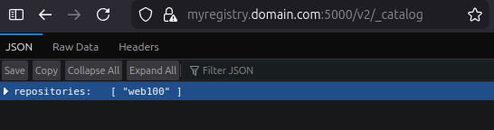
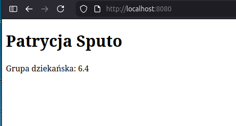

# ETAP 1
Stworzony został plik Dockerfile za pomocą narzędzia `docker init`.

# ETAP 2
Zmodyfikowany został plik Dockerfile.

Dodano folder web, w którym został umieszczony plik html z imieniem i nazwiskiem oraz grupą dziekańską.
**Modyfikacje zostały uzasadnione w komentarzach w pliku Dockerfile**.

Zbudowany został obraz o nazwie web100 za pomocą komendy `docker build -t patrycjasputo/web100:1.0.0 .`.
W tym poleceniu patrycjasputo to nazwa użytkownika, web100 to nazwa obrazu, a 1.0.0 to wersja.

Obraz udało się poprawnie zbudować.

Liczbę warstw sprawdzamy poleceniem `docker history [nazwa obrazu]`, gdzie nazwa obrazu to patrycjasputo/web100:1.0.0.

Wynik polecenia `docker history patrycjasputo/web100:1.0.0`:

| IMAGE | CREATED | CREATED BY | SIZE | COMMENT |
| :--- | :--- | :--- | :--- | :--- |
|`721ee436ded8`|  About a minute ago |  CMD ["apachectl" "-D" "FOREGROUND"]      |       0B |      buildkit.dockerfile.v0 |
|`<missing>` |  About a minute ago  | EXPOSE [80/tcp]                              |   0B       | buildkit.dockerfile.v0 |
|`<missing>` |  About a minute ago  | COPY web/index.html /var/www/html/index.html… |  20.5kB   | buildkit.dockerfile.v0 |
|`<missing>` |  About a minute ago  | RUN /bin/sh -c apt-get update &&     apt-get…  | 177MB    | buildkit.dockerfile.v0 |
|`<missing>` |  About a minute ago  | LABEL author=Patrycja Sputo s101672@pollub.e…   |0B       | buildkit.dockerfile.v0 |
|`<missing>` |  3 weeks ago         | /bin/sh -c #(nop)  CMD ["/bin/bash"]           | 0B       || 
|`<missing>` |  3 weeks ago         | /bin/sh -c #(nop) ADD file:3f78aa860931e0853…  | 87.6MB    ||
|`<missing>` |  3 weeks ago         | /bin/sh -c #(nop)  LABEL org.opencontainers.…  | 0B ||
|`<missing>` | 3 weeks ago          | /bin/sh -c #(nop)  LABEL org.opencontainers.…  | 0B ||
|`<missing>` | 3 weeks ago          | /bin/sh -c #(nop)  ARG LAUNCHPAD_BUILD_ARCH    | 0B ||

Z wyniku tego polecenia wynika, że obraz ma 3 warstwy, ponieważ tylko 3 z nich mają niezerowe wpisy.

# Etap 3

Zalogowano do Docker Hub komendą `docker login`.
Wysłano obraz na Docker Hub za pomocą komendy `docker push patrycjasputo/web100:1.0.0`.

# Zadanie dodatkowe

Stworzono folder `certs` (`mkdir -p certs`).
Dodano go do .gitignore.

Wygenerowano certyfikat za pomocą komendy:

    `openssl req \
     -newkey rsa:4096 -nodes -sha256 -keyout certs/domain.key \
     -addext "subjectAltName = DNS:myregistry.domain.com" \
     -x509 -days 365 -out certs/domain.crt`

Dodano wpis do pliku /etc/hosts.

Utworzono folder: `sudo mkdir -p /etc/docker/certs.d/myregistry.domain.com:5000`.

Skopiowano certyfikat: `sudo cp certs/domain.crt /etc/docker/certs.d/myregistry.domain.com:5000/ca.crt`

Uruchomienierejestru: 

    `docker run -d \
    --restart=always \
    --name registry-secure \
    -v "$(pwd)"/certs:/certs \
    -e REGISTRY_HTTP_ADDR=0.0.0.0:5000 \
    -e REGISTRY_HTTP_TLS_CERTIFICATE=/certs/domain.crt \
    -e REGISTRY_HTTP_TLS_KEY=/certs/domain.key \
    -e REGISTRY_STORAGE_DELETE_ENABLED=true \
    -p 5000:5000 \
    registry:2`

`-v "$(pwd)"/certs:/certs` łączy folder z certyfikatem z kontenerem.
`-e REGISTRY_HTTP_TLS_CERTIFICATE=/certs/domain.crt` i `REGISTRY_HTTP_TLS_KEY=/certs/domain.key` wskazują na pliki z certyfikatem i kluczem.
`-e REGISTRY_STORAGE_DELETE_ENABLED=true` zezwolenie na usuwanie obrazów z rejestru.

Otagowano obraz: `docker tag patrycjasputo/web100:1.0.0 myregistry.domain.com:5000/web100:v1`

Wysłanie obrazu do rejestru: `docker push myregistry.domain.com:5000/web100:v1`

Pomyślnie wysłano obraz. Przy dodawaniu obrazy wyświetlił się nam Digest. Przyda się on później do usuwania obrazu z rejestru.

Sprawdzenie zawartości rejestru: `curl --cacert certs/domain.crt https://myregistry.domain.com:5000/v2/_catalog`

Wynik: `{"repositories":["web100"]}`

Wynik w przeglądarce:

Pobieranie obrazu z rejestru:
    Najpierw usunięto lokalny obraz, żeby docker mógł go pobrać: `docker rmi myregistry.domain.com:5000/web100:v1`

Następnie pobrano obraz: `docker pull myregistry.domain.com:5000/web100:v1`

Sprawdzenie, czy obraz pojawił się na liście obrazów: `docker images | grep web100`

Wynik: 

|myregistry.domain.com:5000/web100:v1|   721ee436ded8    |    371MB     |     107MB|
| :--- | :--- | :--- | :--- |
|patrycjasputo/web100:1.0.0          |   721ee436ded8    |    371MB     |     107MB|

Uruchomienie kontenera: 

    `docker run -d \
    --name strona-testowa \
    -p 8080:80 \
    myregistry.domain.com:5000/web100:v1

Wynik w przeglądarce:

Usuwanie obrazu z rejestru: `curl --cacert certs/domain.crt -v -X DELETE https://myregistry.domain.com:5000/v2/web100/manifests/sha256:721ee436ded82efc760dcc747c9c6380937761e5443c98cfab369e591cffd629`

Odpowiedź: HTTP/2 202 - oznacza to, że usuwanie się udało.

Sprawdzenie (po usunięciu obrazu lokalnie): `docker pull myregistry.domain.com:5000/web100:v1`

Wynik: `Error response from daemon: failed to resolve reference "myregistry.domain.com:5000/web100:v1": myregistry.domain.com:5000/web100:v1: not found`. Udało się poprawnie usunąć obraz.

    

