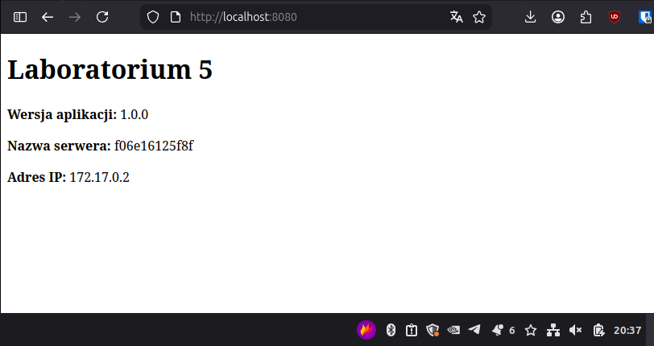

# ETAP 1

W tym etapie został stworzony plik `Dockerfile`. Dopis znajduje się w komentarzach w pliku.

Dodano pliki index.html, config.template.json i start.sh.

Obraz został zbudowany komendą: `docker build --build-arg VERSION=1.0.0 -t local/web:v1 .`

Wynik komendy:
    
    [+] Building 1.9s (16/16) FINISHED                                                                                                                             docker:default
    => [internal] load build definition from Dockerfile                                                                                                                     0.0s
    => => transferring dockerfile: 817B                                                                                                                                     0.0s
    => [internal] load metadata for docker.io/library/nginx:1.28.3-alpine                                                                                                   1.7s
    => [auth] library/nginx:pull token for registry-1.docker.io                                                                                                             0.0s
    => [internal] load .dockerignore                                                                                                                                        0.0s
    => => transferring context: 2B                                                                                                                                          0.0s
    => [internal] load build context                                                                                                                                        0.0s
    => => transferring context: 156B                                                                                                                                        0.0s
    => [stage-1 1/5] FROM docker.io/library/nginx:1.28.3-alpine@sha256:a8b39bd9cf0f83869a2162827a0caf6137ddf759d50a171451b335cecc87d236                                     0.0s
    => => resolve docker.io/library/nginx:1.28.3-alpine@sha256:a8b39bd9cf0f83869a2162827a0caf6137ddf759d50a171451b335cecc87d236                                             0.0s
    => CACHED [builder 1/5] ADD alpine-minirootfs-3.23.3-x86_64.tar /                                                                                                       0.0s
    => CACHED [builder 2/5] WORKDIR /app                                                                                                                                    0.0s
    => CACHED [builder 3/5] COPY index.html .                                                                                                                               0.0s
    => CACHED [builder 4/5] COPY config.template.json .                                                                                                                     0.0s
    => CACHED [builder 5/5] COPY start.sh .                                                                                                                                 0.0s
    => CACHED [stage-1 2/5] COPY --from=builder /app/index.html /usr/share/nginx/html/index.html                                                                            0.0s
    => CACHED [stage-1 3/5] COPY --from=builder /app/config.template.json /app/config.template.json                                                                         0.0s
    => CACHED [stage-1 4/5] COPY --from=builder /app/start.sh /start.sh                                                                                                     0.0s
    => CACHED [stage-1 5/5] RUN chmod +x /start.sh                                                                                                                          0.0s
    => exporting to image                                                                                                                                                   0.1s
    => => exporting layers                                                                                                                                                  0.0s
    => => exporting manifest sha256:175e66690137cebce4b59ed1c2fb1cf8c0b996daaeebf139607077aa722c0354                                                                        0.0s
    => => exporting config sha256:4fcc6f3694796956303bbc64f23a50b76b5fe3fd75ee865128e9fb5ce78f16da                                                                          0.0s
    => => exporting attestation manifest sha256:1ddcb783733f4227521d65cf913a521a2eeb5194763b3514950998417173a150                                                            0.0s
    => => exporting manifest list sha256:ddd7b9e0936e1446cdbe7c8e0871d47eb7b8ea87f7d7f3bbfcef932877714d35                                                                   0.0s
    => => naming to docker.io/local/web:v1                                                                                                                                  0.0s
    => => unpacking to docker.io/local/web:v1                                                                                                                               0.0s

    View build details: docker-desktop://dashboard/build/default/default/bqa8hck9lz07poofnlmt36hfn

# ETAP 2

Polecenie uruchamiające serwer: `docker run -d -p 8080:80 --name=testweb local/web:v1`

Potwierdzenie działania kontenera oraz poprawnego funkcjonowania opracowanej oplikacji: `docker ps`

Wynik:
    
    CONTAINER ID   IMAGE          COMMAND       CREATED          STATUS                    PORTS                                     NAMES
    d0479b4acc9e   local/web:v1   "/start.sh"   11 minutes ago   Up 11 minutes (healthy)   0.0.0.0:8080->80/tcp, [::]:8080->80/tcp   testweb

Poprawne funkcjonowanie aplikacji możemy wywnioskować ze statusu (healthy).

Zrzut ekranu potwierdzający, że aplikacja realizuje wymaganą funkcjonalność:

