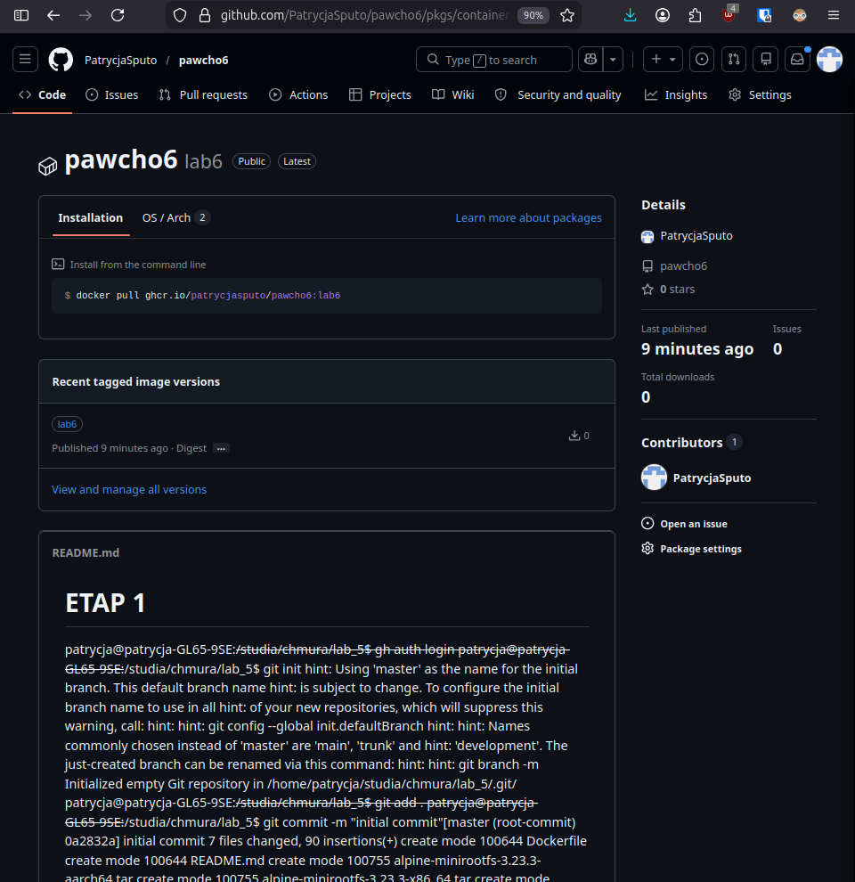

# ETAP 1

Logowanie do github.

    patrycja@patrycja-GL65-9SE:~/studia/chmura/lab_5$ gh auth login

Inicjalizacje lokalnego repozytorium git oraz pierwszy commit.

    patrycja@patrycja-GL65-9SE:~/studia/chmura/lab_5$ git init
    patrycja@patrycja-GL65-9SE:~/studia/chmura/lab_5$ git add .
    patrycja@patrycja-GL65-9SE:~/studia/chmura/lab_5$ git commit -m "initial commit"[master (root-commit) 0a2832a] initial commit
     7 files changed, 90 insertions(+)
     create mode 100644 Dockerfile
     create mode 100644 README.md
     create mode 100755 alpine-minirootfs-3.23.3-aarch64.tar
     create mode 100755 alpine-minirootfs-3.23.3-x86_64.tar
     create mode 100644 config.template.json
     create mode 100644 index.html
     create mode 100644 start.sh

Stworzenie repozytorium za pomocą CLI.

    patrycja@patrycja-GL65-9SE:~/studia/chmura/lab_5$ gh repo create pawcho6 --public --source=. --remote=origin --push
    ✓ Created repository PatrycjaSputo/pawcho6 on GitHub
      https://github.com/PatrycjaSputo/pawcho6
    ✓ Added remote git@github.com:PatrycjaSputo/pawcho6.git
    Enumerating objects: 9, done.
    Counting objects: 100% (9/9), done.
    Delta compression using up to 12 threads
    Compressing objects: 100% (9/9), done.
    Writing objects: 100% (9/9), 7.42 MiB | 3.99 MiB/s, done.
    Total 9 (delta 0), reused 0 (delta 0), pack-reused 0
    To github.com:PatrycjaSputo/pawcho6.git
     * [new branch]      HEAD -> master
    branch 'master' set up to track 'origin/master'.
    ✓ Pushed commits to git@github.com:PatrycjaSputo/pawcho6.git

# ETAP 2

Dodanie `# syntax=docker/dockerfile:1` do początku pliku Dockerfile. Jest to informacja, która mówi, że ma być użyty BuildKit.

# ETAP 3

Wybrano obraz alpine linux jako bazę.

    FROM alpine:3.21 AS builder

Zainstalowanie klienta Git oraz SSH.

    RUN apk add --no-cache git openssh-client

Dodanie klucza publicznego do pliku `known_hosts`, aby uniknąć interaktywnego pytania.

    RUN mkdir -p -m 0700 ~/.ssh && ssh-keyscan github.com >> ~/.ssh/known_hosts

Wykorzystanie mountowania SSH.

    RUN --mount=type=ssh git clone git@github.com:PatrycjaSputo/pawcho6.git .

# ETAP 4

    patrycja@patrycja-GL65-9SE:~/studia/chmura/lab_5$ docker build --ssh default --build-arg VERSION=1.0 -t ghcr.io/patrycjasputo/pawcho6:lab6 .
    [+] Building 2.6s (20/20) FINISHED                               docker:default
     => [internal] load build definition from Dockerfile                       0.0s
     => => transferring dockerfile: 1.04kB                                     0.0s
     => resolve image config for docker-image://docker.io/docker/dockerfile:1  1.8s
     => [auth] docker/dockerfile:pull token for registry-1.docker.io           0.0s
     => CACHED docker-image://docker.io/docker/dockerfile:1@sha256:2780b5c3ba  0.0s
     => => resolve docker.io/docker/dockerfile:1@sha256:2780b5c3bab67f1f76c78  0.0s
     => [internal] load metadata for docker.io/library/alpine:3.21             0.6s
     => [internal] load metadata for docker.io/library/nginx:1.28.3-alpine     0.6s
     => [auth] library/alpine:pull token for registry-1.docker.io              0.0s
     => [auth] library/nginx:pull token for registry-1.docker.io               0.0s
     => [internal] load .dockerignore                                          0.0s
     => => transferring context: 2B                                            0.0s
     => [builder 1/5] FROM docker.io/library/alpine:3.21@sha256:c3f8e73fdb79d  0.0s
     => => resolve docker.io/library/alpine:3.21@sha256:c3f8e73fdb79deaebaa20  0.0s
     => [stage-1 1/5] FROM docker.io/library/nginx:1.28.3-alpine@sha256:a8b39  0.0s
     => => resolve docker.io/library/nginx:1.28.3-alpine@sha256:a8b39bd9cf0f8  0.0s
     => CACHED [builder 2/5] RUN apk add --no-cache git openssh-client         0.0s
     => CACHED [builder 3/5] RUN mkdir -p -m 0700 ~/.ssh && ssh-keyscan githu  0.0s
     => CACHED [builder 4/5] WORKDIR /app                                      0.0s
     => CACHED [builder 5/5] RUN --mount=type=ssh git clone git@github.com:Pa  0.0s
     => CACHED [stage-1 2/5] COPY --from=builder /app/index.html /usr/share/n  0.0s
     => CACHED [stage-1 3/5] COPY --from=builder /app/config.template.json /a  0.0s
     => CACHED [stage-1 4/5] COPY --from=builder /app/start.sh /start.sh       0.0s
     => CACHED [stage-1 5/5] RUN chmod +x /start.sh                            0.0s
     => exporting to image                                                     0.0s
     => => exporting layers                                                    0.0s
     => => exporting manifest sha256:dfd0467a72e80b9d13f8cd8c40fbeb666fdf677e  0.0s
     => => exporting config sha256:e6a82a144ed2f06bf19a036af3bfd2f09568d83bfc  0.0s
     => => exporting attestation manifest sha256:074a540c69a63cfffd7664493391  0.0s
     => => exporting manifest list sha256:2c315e395db8625203a5ad9e3b596b283bf  0.0s
     => => naming to ghcr.io/patrycjasputo/pawcho6:lab6                        0.0s
     => => unpacking to ghcr.io/patrycjasputo/pawcho6:lab6                     0.0s

View build details: docker-desktop://dashboard/build/default/default/8e9r6yo4apxxxpnyhq3dzns09

patrycja@patrycja-GL65-9SE:~/studia/chmura/lab_5$ gh auth token | docker login ghcr.io -u patrycjasputo --password-stdin
Login Succeeded

patrycja@patrycja-GL65-9SE:~/studia/chmura/lab_5$ docker push ghcr.io/patrycjasputo/pawcho6:lab6
The push refers to repository [ghcr.io/patrycjasputo/pawcho6]
bf6b4f173f61: Pushed 
44fa0a5a779f: Pushed 
ddcf2c536688: Pushed 
d631a49fb4f7: Pushed 
98104829f3fe: Pushed 
ff9991358d00: Pushed 
8f7c784e2471: Pushed 
589002ba0eae: Pushed 
0151c82f84a9: Pushed 
fb78f0d431e4: Pushed 
1d9cbdb003be: Pushed 
2772e6b8ee3c: Pushed 
e914c6e98e37: Pushed 
lab6: digest: sha256:2c315e395db8625203a5ad9e3b596b283bf328ef8543e62719aa94d489b85a6d size: 856

# ETAP 5

Widoczność obrazu została zmieniona oraz obraz został połączony z repozytorium `pawcho6`.
Obraz: https://github.com/PatrycjaSputo/pawcho6/pkgs/container/pawcho6

